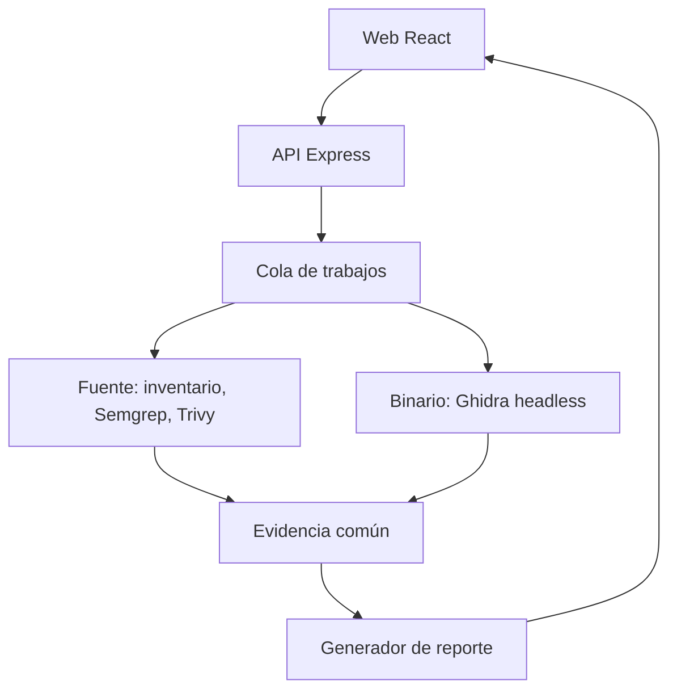

# Code Archaeologist — instrucciones de proyecto para IBM Bob IDE

**Versión de trabajo: 24 de septiembre de 2026.** Este documento es el brief técnico y de ejecución del equipo para el IBM Bob 2.0 Hackathon (25–27 de septiembre de 2026). Colócalo en la raíz del repositorio al comenzar el evento y ábrelo en Bob IDE. El código de la funcionalidad central se construirá dentro de la ventana del hackathon.

## 1. Contexto y objetivo

**Problema:** comprender y preservar una aplicación antigua o poco documentada exige localizar piezas del sistema, dependencias y evidencia técnica. Si solo queda el ejecutable, el conocimiento es todavía más difícil de recuperar.

**Producto:** una web donde se envía una URL de repositorio público, un ZIP de código fuente propio/autorizado o un ejecutable de muestra propio. La API crea un trabajo de análisis; herramientas gratuitas extraen evidencia sin ejecutar el material; un generador determinista produce un reporte de preservación con referencias y límites de confianza. El usuario puede seguir el trabajo y descargar el reporte.

**Resultado demostrable:** analizar un repo de muestra y un binario de muestra, producir informes que distingan hechos de inferencias, y contrastar varias afirmaciones sobre el binario con el fuente original reservado. Mostrar el ahorro de pasos manuales frente a investigar los artefactos por separado.

**Uso de IBM Bob:** Bob IDE ayuda de forma central a planear, implementar y validar varias etapas del flujo. Usar sus capacidades de análisis de código, Plan/Agent, documentación, revisión y, donde aporte, tareas paralelas o subagentes. Guardar evidencia de sus sesiones. **El producto no invoca Bob ni gasta Bobcoins cuando un usuario genera un reporte.** Bob Shell y MCP no son requisitos del MVP; añadirlos solo si las reglas y el tiempo lo justifican.

## 2. Reglas de la guía oficial que condicionan el trabajo

- **Bob IDE es obligatorio; Bob Shell es opcional.** La solución debe mostrar Bob IDE como componente central para ser elegible.
- La guía asigna **40 Bobcoins a cada cuenta proporcionada para el evento**. Al agotarlos no asigna créditos adicionales. Cada integrante debe usar la cuenta del hackathon y vigilar su consumo.
- **Cada participante** debe guardar capturas PNG de los resúmenes de sus tareas relevantes de Bob IDE en `bob_sessions/` dentro del repositorio final. Ejemplo: `equipo_task01_binary_pipeline_summary.png`. Tomarlas durante el trabajo.
- Se permiten otras tecnologías sujetas a sus políticas de uso.
- Usar muestras propias o autorizadas. La guía excluye datos confidenciales de empresas/clientes, información personal y datos de redes sociales; para repos públicos revisar que sus términos permitan el uso previsto y anotar sus URLs/licencias.
- IBM watsonx.ai y watsonx Orchestrate son opcionales. Este MVP no depende de ellos.

Fuente: [Guía oficial IBM Bob 2.0](https://lablab-ibm-bob-2-hackathon-guide.s3.us.cloud-object-storage.appdomain.cloud/index.html). Ante cambios de reglas durante el kickoff, actualizar esta sección antes de implementar.

## 3. Alcance fijado para el MVP

### Entradas

1. **URL de repo público:** solo `https://github.com/<owner>/<repo>`; descargar/clonar una revisión y registrar el commit exacto. Sin OAuth ni GitHub App.
2. **ZIP de fuente:** subida de una copia pequeña propia o autorizada; inventariar su contenido sin ejecutar scripts.
3. **Binario:** ejecutable PE x64 creado por el equipo. Inspección estática con Ghidra en modo headless. Admitir otros formatos solo tras completar el flujo principal.

### Salidas

- Página de estado con fases y errores reales.
- Evidencia estructurada por análisis, con origen y referencia comprobable.
- Reporte HTML legible y descarga Markdown o JSON. Apartados: identificación; hallazgos observados; inferencias justificadas; dependencias y riesgos detectados; desconocidos; recomendaciones de preservación; limitaciones.
- **Ninguna vulnerabilidad se declara confirmada solo por coincidir con una regla o una dependencia.** Identificar «hallazgo para revisar» y enlazar el resultado del escáner.

### Fuera de alcance

Repos privados, autenticación GitHub, ejecución de binarios o del código recibido, emulación, reconstrucción del fuente original, hallazgos de seguridad garantizados, IA local obligatoria, reportes redactados mediante APIs de pago y despliegue público que acepte binarios arbitrarios.

## 4. Arquitectura



**Stack preferido:** React + TypeScript y Vite para cliente; Node.js + Express + TypeScript + Zod para API; archivos locales para resultados en demo; `git` para repos públicos; Ghidra para binarios; Semgrep Community Edition para hallazgos estáticos de fuente; Trivy para dependencias/secretos/configuraciones cuando tenga cobertura. Usar instalaciones locales y salida JSON/archivos; **sin servicios de análisis de pago**. Si una herramienta no está disponible, mostrar «análisis parcial» y dejar explícito qué faltó, nunca fabricar resultados.

**Jobs:** `queued → preparing → scanning → reporting → completed`, o `failed` con fase y causa. El POST responde de inmediato con `jobId`; el cliente consulta el estado con polling. Un trabajador local y un trabajo simultáneo bastan para la demo. Definir límites de tamaño, duración y retención de temporales; cancelar procesos que excedan el tiempo. Esta cola en memoria pierde trabajos al reiniciar: documentarlo, o persistir metadatos en SQLite si queda tiempo.

**API mínima propuesta:**

| Método y ruta | Propósito |
| --- | --- |
| `POST /api/analyses/repository` | JSON `{ "url": "https://github.com/owner/repo" }` → `202` + `jobId`. |
| `POST /api/analyses/source-zip` | Archivo multipart → `202` + `jobId`. |
| `POST /api/analyses/binary` | Archivo multipart → `202` + `jobId`. |
| `GET /api/analyses/:id` | Estado, progreso por fase, origen, advertencias y error si aplica. |
| `GET /api/analyses/:id/report` | Reporte solo cuando terminó; de lo contrario estado acorde a la API. |

No basta con confiar en extensión, nombre o URL: validar contenido, formato y límites. Clonar URL pública con argumentos separados y host permitido; no construir comandos shell con entrada del usuario. Al procesar ZIP, impedir rutas `..`, symlinks y descompresión excesiva. Mantener archivos del trabajo en un directorio aislado; eliminar resultados al terminar la retención configurada. No enviar contenidos privados ni secretos a servicios externos.

## 5. Dos analizadores, un formato de evidencia

### Código fuente

1. Recibir ZIP o clonar un repositorio público y fijar el commit.
2. Inventariar archivos y manifiestos (`package.json`, `composer.json`, `requirements.txt`, `.csproj`, etc.); reconocer lenguajes y dependencias. No instalar paquetes ni ejecutar scripts del repo.
3. Detectar puntos de entrada y estructura con reglas explícitas **acotadas al stack de la muestra**. Para TypeScript/Express, identificar rutas/controladores desde convenciones o AST si es necesario; no prometer análisis semántico universal.
4. Ejecutar Semgrep CE y Trivy sobre la copia aislada, con salida JSON y límites. Trivy puede requerir descargar/actualizar bases de vulnerabilidades; preparar la demo con antelación y mostrar fecha de datos usada. Un escáner que falla deja advertencia de cobertura.
5. Convertir resultados a evidencia común con archivo, línea/regla cuando aplique; registrar también ausencia de cobertura. Nunca incluir contenido de `.env`, llaves, tokens ni secretos en el reporte.

### Binario

1. Validar muestra PE x64 y calcular SHA-256.
2. Lanzar `analyzeHeadless` de Ghidra como proceso hijo. Un script propio exporta a JSON formato, arquitectura, imports, cadenas seleccionadas, funciones y pseudocódigo de un número pequeño de funciones bajo límites de tiempo.
3. Registrar dirección de función y origen de cada hallazgo; el pseudocódigo **no es el código original**. Una cadena o import no demuestra por sí mismo una funcionalidad ni una vulnerabilidad.
4. No ejecutar el binario. Si Ghidra falla o expira, fallar el trabajo o producir reporte parcial explícito.

### Contrato normalizado sugerido

```json
{
  "analysisId": "uuid",
  "origin": "source-repository | source-zip | binary",
  "input": { "name": "demo", "sha256": "...", "commit": null },
  "tools": [{ "name": "ghidra", "status": "completed", "version": "..." }],
  "observations": [
    {
      "id": "obs-001",
      "kind": "import | string | file | dependency | finding | function",
      "summary": "CreateFileW importado",
      "source": { "tool": "ghidra", "path": null, "line": null, "address": "0x..." }
    }
  ],
  "warnings": []
}
```

La forma final puede cambiar durante implementación, pero ambos analizadores deben entregar el mismo tipo validado por Zod. **Guardar también los JSON originales** de cada herramienta para auditoría; el reporte usa referencias a observaciones concretas. Una inferencia tiene `evidenceIds`, explicación y grado de confianza cualitativo; no inventar un porcentaje.

## 6. Reporte sin IA de pago

Implementar un generador **determinista** de Markdown/HTML a partir de la evidencia validada. Puede crear oraciones controladas como «se detectó una dependencia declarada», «el binario importa esta función» o «Semgrep señaló este patrón en este archivo». La sección «posible función del sistema» se redacta únicamente si hay varias pistas y se etiqueta como inferencia. Cada afirmación técnica importante enlaza a observaciones, archivo/línea o dirección.

El producto debe ser útil **sin modelo local**. Una capa opcional con IA local se considera solo si el flujo completo ya funciona, la máquina disponible la soporta y su salida se valida contra la evidencia; no sustituye hallazgos ni conclusiones comprobables. No incluirla en el camino crítico de entrega.

## 7. Interfaz mínima

1. Inicio con tres opciones: URL pública, ZIP de fuente, binario de muestra.
2. Vista de job con origen, identificador, fases, advertencias y error legible.
3. Vista de reporte con etiquetas «Observado», «Inferido» y «No determinado», referencias a evidencia, fecha/versión de herramientas y botón de descarga.

Evitar pantallas de login, gestión de usuarios, pagos o visualizaciones complejas. La web no debe marcar «completo» hasta recibir un reporte real. Para demo, restringir el binario a muestras del equipo si no hay aislamiento robusto de servidor público.

## 8. Ruta de trabajo en Bob IDE

**Antes del kickoff:** instalar Bob IDE y herramientas, comprobar entorno y estudiar documentación. No implementar la funcionalidad principal antes de que empiece la ventana si las bases lo requieren.

**Al comenzar:** abrir el repositorio en Bob IDE, iniciar sesión con la cuenta del evento, añadir este archivo y pedir a Bob que revise el brief y proponga una secuencia corta de tareas. Anotar saldo Bobcoins inicial. Trabajar en tareas acotadas, probar cambios y tomar captura del resumen de cada tarea relevante. No pedirle «construye todo» en una conversación larga.

| Prioridad | Entregable verificable | Evidencia para Bob IDE |
| --- | --- | --- |
| 1 | Esquema común + generador de reporte con una muestra fija y prueba de trazabilidad. | Diseño/implementación y revisión del contrato. |
| 2 | API de jobs + una ruta de entrada y polling hasta reporte real. | Plan y cambio de varios archivos. |
| 3 | Pipeline de fuente: URL/ZIP, inventario, Semgrep/Trivy, normalización. | Bob inspecciona resultados y corrige la integración. |
| 4 | Pipeline binario: Ghidra headless, script exportador y normalización. | Bob ayuda a automatizar y validar contra fuente reservado. |
| 5 | Web React de tres pantallas, demo y documentación. | Bob construye o revisa el flujo completo. |

Distribuir estas tareas entre integrantes según disponibilidad; evitar que cuatro personas modifiquen simultáneamente el mismo contrato. Integrar temprano. Si el tiempo aprieta, terminar primero una ruta de extremo a extremo y luego la segunda. Registrar consumo después de cada tarea; reservar crédito para depuración y revisión final. **No es necesario reservar Bobcoins para que usuarios de la web generen reportes**, porque ese reporte no llama a Bob.

### Primera instrucción para pegar en Bob IDE

```text
Lee @BOB_IDE_PROJECT_BRIEF.md y la guía oficial enlazada allí. Estamos en el IBM Bob 2.0 Hackathon. Ayúdame a construir Code Archaeologist durante la ventana del evento. Antes de editar, resume el MVP, las reglas que afectan el proyecto, los riesgos de la integración y una secuencia de entregables verificables. Trabaja en la primera tarea de extremo a extremo cuando apruebe el plan. Mantén acotado el contexto y el consumo de Bobcoins. No inventes resultados de Ghidra, Semgrep ni Trivy; no ejecutes el material que el usuario envíe. Al terminar cada tarea, muestra archivos cambiados, comandos de verificación y limitaciones.
```

### Prompts por fase (usar solo cuando corresponda)

1. **Contrato/reporte:** «Diseña y prueba un esquema Zod común para observaciones de fuente y binario. Implementa un reporte Markdown determinista en el que cada inferencia apunte a IDs de evidencia; comienza con una muestra fija realista. Muestra un caso observado, uno inferido y uno desconocido.»
2. **Jobs/API:** «Implementa el ciclo `queued/preparing/scanning/reporting/completed/failed` en la API. POST devuelve 202 con jobId y GET permite seguirlo. Verifica éxito, error y timeout con una tarea de prueba; no bloquees la solicitud HTTP.»
3. **Fuente:** «Implementa la ingesta de ZIP y repositorio público permitidos. No ejecutes código del repo. Normaliza inventario y resultados JSON de Semgrep CE y Trivy; registra herramientas fallidas como cobertura parcial. Prueba un repo de muestra propio.»
4. **Binario:** «Automatiza Ghidra headless para nuestra muestra PE x64. Escribe un script que exporte imports, cadenas relevantes y hasta N funciones con direcciones y pseudocódigo; añade timeout y valida el JSON. Contrasta los hallazgos con el fuente reservado.»
5. **Web/demo:** «Construye la web React para crear un job, seguir estados reales y mostrar el reporte con referencias. Revisa el flujo completo y prepara instrucciones reproducibles. No muestres hallazgos simulados como reales.»

## 9. Pruebas y criterios de aceptación

- Para fuente: ZIP válido y repo público de prueba → estado `completed`, commit/hash y reporte con archivo/línea donde corresponda. ZIP con `../`, repo privado o URL ajena a GitHub → rechazo legible sin ejecutar contenido.
- Para binario: muestra propia → Ghidra exporta datos y el reporte enlaza imports/strings/funciones a direcciones. Falla/timeout → error o parcial explícito; sin ejecución del binario.
- Para reporte: toda inferencia tiene evidencia; un escáner sin resultados no equivale a «seguro»; los datos omitidos aparecen como «No determinado».
- Para web: el POST responde antes de terminar el análisis; polling enseña transición real; descarga corresponde al `jobId` pedido.
- Comparación de la demo: registrar 5–8 afirmaciones comprobables contra el fuente reservado, con aciertos, errores y desconocidos. Guardar tiempos de análisis para demostrar impacto sin inventar métricas.
- Antes de entregar: ejecutar las pruebas y una demo completa desde un entorno limpio; comprobar que `bob_sessions/` contiene capturas legibles de **cada participante** y que no hay secretos ni datos prohibidos en el repo.

## 10. Entregables finales

Repositorio público con código, instrucciones de instalación y ejecución, muestras propias y licencias; reporte(s) generados; video o demostración que muestre entradas, jobs, evidencia y resultado; tabla de validación frente al fuente; carpeta `bob_sessions/` con las capturas requeridas por la guía. Revisar en Lablab los campos exactos de envío y horarios antes de entregar.

## 11. Referencias técnicas

- [Guía oficial IBM Bob 2.0](https://lablab-ibm-bob-2-hackathon-guide.s3.us.cloud-object-storage.appdomain.cloud/index.html)
- [Ghidra y su analizador headless](https://ghidra.re/ghidra_docs/GhidraClass/BSim/BSimTutorial_Ghidra_Command_Line.html)
- [Semgrep Community Edition](https://semgrep.dev/products/community-edition)
- [Trivy: escaneo de sistema de archivos](https://trivy.dev/docs/latest/target/filesystem/)
- [IBM Bob: gestión de Bobcoins](https://bob.ibm.com/docs/ide/account/bobcoins)
