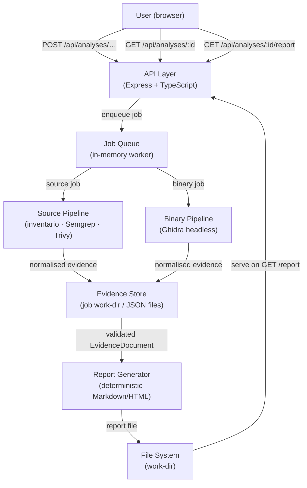

# Architecture

> Code Archaeologist · docs/01-architecture.md

---

## 1. High-Level Diagram



---

## 2. Layer Responsibilities

### 2.1 API Layer (`api/src/routes/`)

- Validates all incoming requests with Zod before touching the file system.
- Creates a job record and enqueues work; never waits for analysis to complete.
- Returns `202 Accepted` with `{ jobId }` on creation.
- Returns `200` with the full `JobStatus` document on poll.
- Returns `200` with the report content (or `404/409` if not ready) on report request.
- Enforces size limits, allowed MIME types, and host allow-list (github.com only).

### 2.2 Job Queue (`api/src/jobs/`)

- Single-threaded worker processes one job at a time (demo constraint).
- Advances the job through states: `queued → preparing → scanning → reporting → completed | failed`.
- Stores the current state and per-phase metadata in the in-memory job map (and optionally SQLite).
- Cancels child processes that exceed the configured `ANALYSIS_TIMEOUT_MS`.

### 2.3 Source Pipeline (`api/src/analysers/source/`)

- Accepts a local directory (already extracted or cloned).
- Inventories files, detects languages, finds manifest files.
- Runs Semgrep CE via CLI with JSON output.
- Runs Trivy filesystem scan with JSON output.
- Normalises both outputs to the shared `EvidenceDocument` Zod schema.
- Saves raw tool JSON for audit.

### 2.4 Binary Pipeline (`api/src/analysers/binary/`)

- Validates PE x64 magic bytes and calculates SHA-256.
- Launches Ghidra `analyzeHeadless` as a child process with a custom export script.
- The script exports: format, architecture, imports, selected strings, and up to N functions with addresses and pseudocode.
- Normalises the Ghidra JSON output to `EvidenceDocument`.
- Saves raw Ghidra JSON for audit.

### 2.5 Report Generator (`api/src/report/`)

- Reads the validated `EvidenceDocument` from the evidence store.
- Produces Markdown with controlled, evidence-referenced sentences.
- Sections: Identification · Observed Findings · Justified Inferences · Dependencies & Risks · Unknowns · Preservation Recommendations · Limitations.
- Every inference carries `evidenceIds` and a qualitative confidence label (`low | medium | high`).
- Converts Markdown to a self-contained HTML file.
- Also writes a JSON export of the full evidence document.

### 2.6 Web (`web/src/`)

- Three pages: Home (submission form) · Job Status · Report Viewer.
- Polls `GET /api/analyses/:id` every 2 s until terminal state.
- Renders report sections with `Observed / Inferred / Unknown` badges.
- Download buttons for HTML and JSON report.

---

## 3. Data Flow per Input Type

### Repository URL

```
POST /api/analyses/repository
  └─ validate URL (github.com, public)
  └─ enqueue → preparing: git clone --depth 1 <url> into work-dir, record commit SHA
  └─ scanning: inventory + Semgrep + Trivy on work-dir
  └─ reporting: build EvidenceDocument → generate report
  └─ completed
```

### Source ZIP

```
POST /api/analyses/source-zip  (multipart, max 50 MB)
  └─ validate MIME = application/zip, max size
  └─ enqueue → preparing: extract ZIP (no path traversal, no symlinks) into work-dir, record SHA-256
  └─ scanning: inventory + Semgrep + Trivy on work-dir
  └─ reporting: build EvidenceDocument → generate report
  └─ completed
```

### Binary

```
POST /api/analyses/binary  (multipart, max 100 MB)
  └─ validate PE magic (MZ header), max size
  └─ enqueue → preparing: copy to work-dir, record SHA-256
  └─ scanning: Ghidra analyzeHeadless → export JSON
  └─ reporting: build EvidenceDocument → generate report
  └─ completed
```

---

## 4. Security Boundaries

| Concern | Mitigation |
|---|---|
| Path traversal in ZIP | Strip `../` components; reject symlinks; use `safe-extract` logic |
| Shell injection | `git clone` and `ghidra` invoked with `spawn(cmd, args[])`, never `exec(string)` |
| Host allow-list | Only `https://github.com/` URLs accepted |
| Temp data leakage | Work-dirs are under a configured `WORK_DIR` path; cleaned after retention window |
| Secrets in output | Patterns for `.env`, API keys, JWTs filtered from string observations |
| Binary execution | Binary is never launched; only Ghidra reads it |

---

## 5. Configuration Surface

All values via environment variables (`.env` in dev, injected in prod):

| Variable | Default | Description |
|---|---|---|
| `PORT` | `3000` | API listen port |
| `WORK_DIR` | `./work` | Base directory for job work-dirs |
| `MAX_ZIP_MB` | `50` | Max ZIP upload size |
| `MAX_BINARY_MB` | `100` | Max binary upload size |
| `ANALYSIS_TIMEOUT_MS` | `300000` | 5-minute timeout per analysis phase |
| `JOB_RETENTION_MS` | `3600000` | 1-hour retention before work-dir cleanup |
| `GHIDRA_HOME` | `/opt/ghidra` | Path to Ghidra installation |
| `SEMGREP_BIN` | `semgrep` | Semgrep binary (in PATH) |
| `TRIVY_BIN` | `trivy` | Trivy binary (in PATH) |
| `MAX_GHIDRA_FUNCTIONS` | `20` | Max functions with pseudocode exported |
| `ALLOWED_GITHUB_HOST` | `github.com` | Enforce this host for repo URLs |
