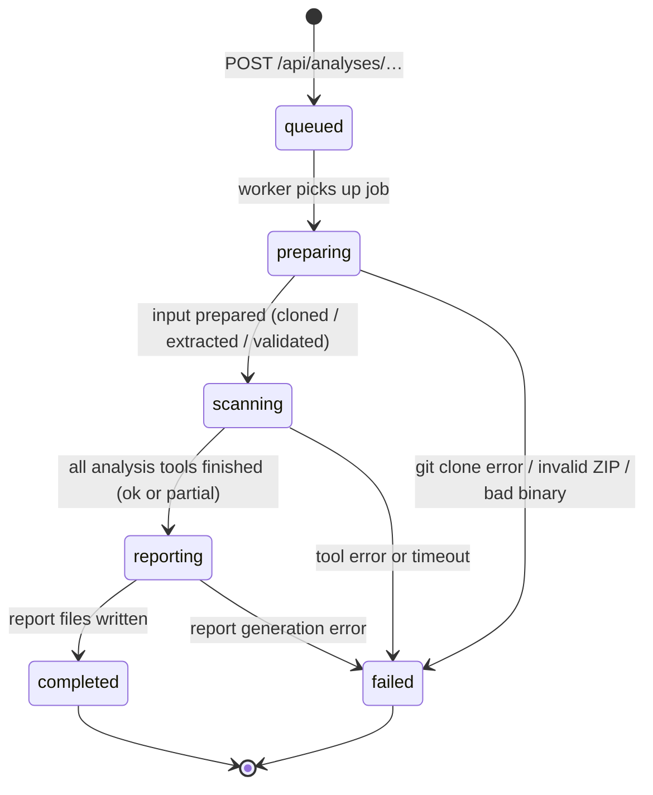

# Job Lifecycle

> Code Archaeologist · docs/04-job-lifecycle.md

---

## 1. State Machine



---

## 2. Phase Descriptions

| Phase | Entry Condition | Exit Condition (success) | Work Done |
|---|---|---|---|
| `queued` | Job created via POST | Worker picks it from queue | Record created, work-dir allocated |
| `preparing` | Worker dequeues job | Input is on disk, validated, SHA-256/commit recorded | Clone repo / extract ZIP / copy binary; validate format |
| `scanning` | `preparing` succeeded | All enabled tools have produced output (complete or partial) | Semgrep + Trivy (source) or Ghidra (binary) run in isolated work-dir |
| `reporting` | `scanning` succeeded | `evidence.json`, `report.md`, `report.html`, `report.json` written | Normalise raw tool output → `EvidenceDocument`; run report generator |
| `completed` | `reporting` succeeded | — | Terminal state; report available for download |
| `failed` | Any phase throws / times out | — | Terminal state; `error` field populated |

---

## 3. Phase Transitions in Code

Each transition must:

1. Update `job.status` to the new phase name.
2. Set `phase.startedAt` (when entering) and `phase.endedAt` (when leaving).
3. Set `phase.status` to `running` on enter, `completed` or `failed` on exit.
4. Persist `meta.json` to disk after every transition.
5. Broadcast the new state to in-memory listeners (polled by GET endpoint).

```ts
// Pseudocode — api/src/jobs/worker.ts

async function processJob(job: JobRecord): Promise<void> {
  try {
    await transition(job, "preparing");
    await prepareInput(job);

    await transition(job, "scanning");
    await runScanners(job);

    await transition(job, "reporting");
    await generateReport(job);

    await transition(job, "completed");
  } catch (err) {
    await failJob(job, currentPhase(job), err);
  }
}
```

---

## 4. Timeout Handling

- Each phase runs inside `Promise.race([phaseWork(), timeout(ANALYSIS_TIMEOUT_MS)])`.
- On timeout: the child process (Ghidra / Semgrep / Trivy / git) is killed with `SIGTERM`, then `SIGKILL` after 5 s.
- The job transitions to `failed` with `cause: "TIMEOUT"` and the phase name recorded.
- Partial results written before the timeout are **not** used — the report is marked failed.

---

## 5. Partial Analysis

Timeouts fail the whole job. However, **tool-level failures within the scanning phase do not automatically fail the job**:

- If Semgrep exits non-zero or is not installed → add `warnings: ["semgrep: tool unavailable — coverage partial"]`; continue.
- If Trivy exits non-zero → same pattern.
- If Ghidra exits non-zero or is not installed → fail the job (it is the only binary tool).
- If both Semgrep and Trivy fail for a source job → fail the job (no evidence was collected).

The rule: **at least one tool must produce usable output or the job fails**.

---

## 6. Queue Behaviour

```
┌─────────────────────────────────────┐
│           In-Memory Queue           │
│                                     │
│  [ job1 (running) ]                 │
│  [ job2 (queued)  ]  ← max 10      │
│  [ job3 (queued)  ]                 │
└─────────────────────────────────────┘
```

- Queue is a simple FIFO array in memory.
- Worker loop: `while (true) { job = queue.shift(); await processJob(job); }`
- Only one job runs at a time (demo constraint).
- If queue depth ≥ `MAX_QUEUE_DEPTH` (10), POST returns `503 Service Unavailable` with `QUEUE_FULL`.
- On server restart: all non-terminal in-memory jobs are lost. `meta.json` on disk records their last known state (typically `scanning` or `preparing`). These are **not** auto-recovered; they appear as stale `meta.json` files. The optional SQLite layer can mark these as `failed` on boot.

---

## 7. Retention and Cleanup

- A cleanup timer runs every 5 minutes.
- Any completed or failed job older than `JOB_RETENTION_MS` (default 1 hour):
  1. Has its work-dir deleted recursively.
  2. Is removed from the in-memory job map.
- After deletion, `GET /api/analyses/:id` returns `404 JOB_NOT_FOUND`.
- This behaviour is documented in the API response for `404`.

---

## 8. Concurrency Model

```
HTTP thread (main)
│
├── POST /api/analyses/…  → enqueue() → return 202
├── GET  /api/analyses/:id → read job map → return 200
└── GET  /api/analyses/:id/report → read file → return 200

Worker loop (setImmediate / async loop)
│
└── processJob(job)
    ├── prepareInput()   (child: git / unzip)
    ├── runScanners()    (child: semgrep / trivy / ghidra)
    └── generateReport() (sync CPU work)
```

The worker never blocks the event loop during HTTP requests. Child processes are spawned with `child_process.spawn`; no shell string interpolation.

---

## 9. Error Payload Structure

When a job reaches `failed`:

```json
{
  "jobId": "...",
  "status": "failed",
  "error": {
    "phase": "scanning",
    "message": "Ghidra analyzeHeadless exited with code 1",
    "cause": "TOOL_ERROR"
  }
}
```

`cause` values: `TIMEOUT | TOOL_ERROR | VALIDATION_ERROR | UNKNOWN`

The full stderr of the failed child process is written to `<workDir>/raw/<tool>-stderr.txt` for debugging. It is **not** included in the API response.
