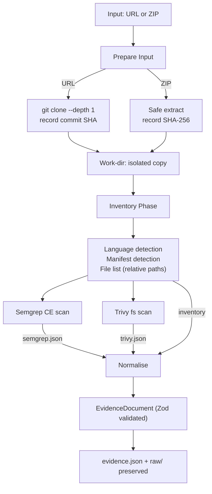

# Source Pipeline

> Code Archaeologist · docs/05-source-pipeline.md

---

## 1. Responsibilities

The source pipeline handles two input types — public GitHub repository URLs and uploaded ZIP archives — and produces a single normalised `EvidenceDocument`.

---

## 2. Flow



---

## 3. Prepare Input

### 3.1 Repository URL

```ts
// Pseudocode
const args = ["clone", "--depth", "1", "--", url, destDir];
await spawnSafe("git", args, { timeout: ANALYSIS_TIMEOUT_MS });
const commit = await getHeadCommit(destDir);   // git rev-parse HEAD
```

- `url` is passed as a positional argument — **never interpolated into a shell string**.
- `git` is the only allowed host; validated before this call.
- Working tree is cloned into `<workDir>/input/repo/`.

### 3.2 ZIP Upload

```ts
// Pseudocode
const buffer = fs.readFileSync(uploadPath);
validateMagicBytes(buffer, [0x50, 0x4B, 0x03, 0x04]);  // PK ZIP magic
const sha256 = crypto.createHash("sha256").update(buffer).digest("hex");
await safeExtract(buffer, destDir, {
  maxFiles: 500,
  maxUncompressedBytes: 200 * 1024 * 1024,  // 200 MB
  blockPathTraversal: true,
  blockSymlinks: true,
});
```

---

## 4. Inventory Phase

Walks the extracted directory tree and produces:

| Output | Description |
|---|---|
| File list | All relative paths (no content) |
| Language hints | File extension → language mapping |
| Manifest files | `package.json`, `requirements.txt`, `composer.json`, `*.csproj`, `go.mod`, `Gemfile`, `pom.xml`, `build.gradle`, `Cargo.toml` |
| Dependency list | Parsed from found manifests (names + versions; no install) |
| Entry-point hints | `main`, `index`, `app`, `server` patterns in filenames |

**Nothing is executed or installed.** No `npm install`, no `pip install`.

Inventory is converted to `Observation` records of kind `file` and `dependency`.

---

## 5. Semgrep CE

```ts
const args = [
  "--config", "auto",
  "--json",
  "--output", semgrepOutputPath,
  "--timeout", "120",
  "--max-memory", "512",
  "--no-git-ignore",
  destDir,
];
await spawnSafe("semgrep", args, { timeout: 150_000 });
```

**Normalisation rules:**
- Each Semgrep result → `Observation` with `kind: "finding"`.
- `source.path` = relative path within analysed dir.
- `source.line` = check result start line.
- `source.ruleId` = Semgrep rule ID (e.g. `python.django.security.…`).
- `summary` = `[${ruleId}] ${message}` (trimmed to 500 chars).
- `detail` = the matched code snippet (trimmed to 4 000 chars).
- Severity from Semgrep is preserved as a `tag` (e.g. `severity:WARNING`).

**If Semgrep is not installed or exits non-zero:**
- Add `ToolRecord { name:"semgrep", status:"failed", warning:"not installed or scan failed" }`.
- Add warning to `EvidenceDocument.warnings`.
- Continue (does not fail the job unless Trivy also fails).

---

## 6. Trivy

```ts
const args = [
  "fs",
  "--format", "json",
  "--output", trivyOutputPath,
  "--timeout", "2m",
  "--skip-update",          // use existing DB to avoid network delay in demo
  destDir,
];
await spawnSafe("trivy", args, { timeout: 150_000 });
```

**Note:** Trivy's vulnerability DB must be downloaded before the demo (`trivy image --download-db-only`). The `dataDate` field in `ToolRecord` is set to the DB schema date from Trivy's JSON output.

**Normalisation rules:**
- Each Trivy vulnerability → `Observation` with `kind: "dependency"`.
- `source.ruleId` = CVE ID or advisory ID.
- `summary` = `${pkgName}@${version}: ${title}` (trimmed).
- `detail` = description field (trimmed to 4 000 chars).
- Tags: `severity:<CRITICAL|HIGH|MEDIUM|LOW>`, `ecosystem:<npm|pypi|…>`.
- Secret findings from Trivy → `kind: "secret-pattern"`.
- Configuration findings → `kind: "finding"`.

**Exclusion rule:** Never include finding `detail` that contains patterns matching private key formats, `.env` content, or JWT tokens. Strip matched content and replace with `[REDACTED — potential secret]`.

---

## 7. Evidence Assembly

```ts
function assembleEvidenceDocument(
  jobId: string,
  origin: JobOrigin,
  input: InputMetadata,
  inventoryObs: Observation[],
  semgrepObs: Observation[],
  trivyObs: Observation[],
  tools: ToolRecord[],
  warnings: string[]
): EvidenceDocument {
  const observations = [
    ...inventoryObs,
    ...semgrepObs,
    ...trivyObs,
  ].map((obs, i) => ({ ...obs, id: `obs-${String(i + 1).padStart(3, "0")}` }));

  // Inferences: generated only when multiple corroborating observations exist
  const inferences = deriveInferences(observations);

  const unknowns = deriveUnknowns(observations, tools);

  return EvidenceDocument.parse({
    analysisId: jobId,
    origin,
    generatedAt: new Date().toISOString(),
    input,
    tools,
    observations,
    inferences,
    unknowns,
    warnings,
  });
}
```

---

## 8. Inference Rules (Source)

Inferences are generated only from patterns of observations — not from single data points:

| Inference | Required Evidence |
|---|---|
| "Project appears to be a web server" | ≥2 files matching `server|app|index` pattern + HTTP dependency in manifest |
| "Project likely uses database access" | ORM dependency (sequelize, typeorm, prisma, sqlalchemy, django.db) in manifest |
| "Authentication present" | `passport`, `bcrypt`, `jwt`, `jsonwebtoken`, `authlib` in manifest |
| "Environment variable configuration" | `dotenv` dependency + `.env.example` or `config.env` file present |

Every inference record includes the `evidenceIds` of the observations that triggered it, plus a qualitative confidence label.

---

## 9. What is Never Reported

- Content of `.env`, `*.key`, `*.pem`, `*.p12` files.
- Any finding detail that matches a private key, token, or credential pattern (replaced with `[REDACTED]`).
- File contents beyond the matched Semgrep snippet.
- A vulnerability as "confirmed" — only "finding for review" with a link to the scanner result.
