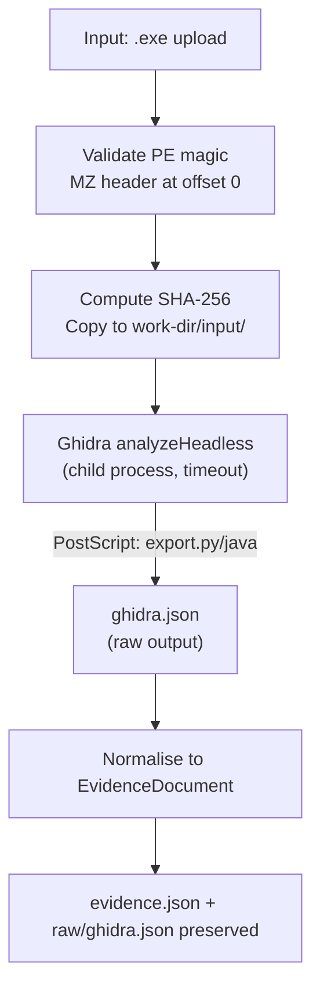

# Binary Pipeline

> Code Archaeologist · docs/06-binary-pipeline.md

---

## 1. Responsibilities

Validate a PE x64 binary, run Ghidra headless analysis with a custom export script, and normalise the output into a shared `EvidenceDocument`.

The binary is **never executed**. Only Ghidra reads it.

---

## 2. Flow



---

## 3. Input Validation

```ts
function validatePEBinary(buffer: Buffer): void {
  // PE magic: 'MZ' at offset 0 (0x4D 0x5A)
  if (buffer.length < 2 || buffer[0] !== 0x4D || buffer[1] !== 0x5A) {
    throw new ValidationError("File does not appear to be a PE binary (missing MZ header)");
  }
  // Minimum viable PE header check
  if (buffer.length < 0x40) {
    throw new ValidationError("File too small to be a valid PE binary");
  }
}
```

Validation happens during `preparing` phase — before Ghidra is invoked.

---

## 4. Ghidra Invocation

```ts
const args = [
  ghidraProjectDir,           // temp project dir inside work-dir
  "TempProject",              // project name
  "-import",   binaryPath,
  "-postScript", exportScriptPath,
  "-scriptPath", scriptsDir,
  "-scriptlog", scriptLogPath,
  "-log",       ghidraLogPath,
  "-deleteProject",
];

await spawnSafe(
  path.join(GHIDRA_HOME, "support", "analyzeHeadless"),
  args,
  { timeout: ANALYSIS_TIMEOUT_MS, cwd: workDir }
);
```

- `binaryPath` is a resolved absolute path — never user-controlled string interpolation.
- `GHIDRA_HOME` is from environment config, not the request.
- Ghidra creates a temporary project in `<workDir>/ghidra-project/` which is cleaned up by `-deleteProject`.
- Output JSON is written by the export script to `<workDir>/raw/ghidra.json`.

---

## 5. Export Script

File: `api/scripts/ghidra/ExportAnalysis.java` (Ghidra headless script)

The script exports:

```json
{
  "format": "PE",
  "architecture": "x86:LE:64:default",
  "compiler": "windows/x86/pe/64/gcc",
  "imageBase": "0x140000000",
  "imports": [
    {
      "library": "KERNEL32.dll",
      "name": "CreateFileW",
      "address": "0x140012345"
    }
  ],
  "strings": [
    {
      "value": "Software\\Microsoft\\Windows",
      "address": "0x140023456",
      "length": 32
    }
  ],
  "functions": [
    {
      "name": "FUN_14001a000",
      "address": "0x14001a000",
      "size": 128,
      "calledFunctions": ["CreateFileW", "CloseHandle"],
      "pseudocode": "void FUN_14001a000(void) {\n  // ...\n}"
    }
  ]
}
```

**Script constraints:**
- Maximum `MAX_GHIDRA_FUNCTIONS` (default 20) functions exported with pseudocode.
- Functions selected by size (largest first) as a heuristic for "most complex logic".
- Strings filtered: min length 6, exclude pure numeric/whitespace strings.
- Pseudocode is Ghidra's decompiler output — **not the original source**.
- Each pseudocode block capped at 4 000 characters.

---

## 6. Normalisation

```ts
function normaliseGhidraOutput(raw: GhidraRawOutput): Observation[] {
  const obs: Observation[] = [];

  // Format / architecture observation
  obs.push({
    kind: "file",
    summary: `PE binary: ${raw.format}, ${raw.architecture}`,
    detail: `Compiler hint: ${raw.compiler ?? "unknown"} | Image base: ${raw.imageBase}`,
    source: { tool: "ghidra", path: null, line: null, address: raw.imageBase, ruleId: null },
    tags: ["binary-format"],
  });

  // Imports
  for (const imp of raw.imports) {
    obs.push({
      kind: "import",
      summary: `${imp.library} → ${imp.name}`,
      detail: null,
      source: { tool: "ghidra", path: null, line: null, address: imp.address, ruleId: null },
      tags: [categoriseImport(imp.name)],  // "file-io", "network", "crypto", "process", "registry", etc.
    });
  }

  // Strings
  for (const str of raw.strings) {
    if (shouldRedactString(str.value)) continue;
    obs.push({
      kind: "string",
      summary: str.value.slice(0, 120),
      detail: str.value,
      source: { tool: "ghidra", path: null, line: null, address: str.address, ruleId: null },
      tags: categoriseString(str.value),
    });
  }

  // Functions
  for (const fn of raw.functions) {
    obs.push({
      kind: "function",
      summary: `Function ${fn.name} at ${fn.address} (${fn.size} bytes)`,
      detail: fn.pseudocode,
      source: { tool: "ghidra", path: null, line: null, address: fn.address, ruleId: null },
      tags: fn.calledFunctions.map((c) => `calls:${c}`),
    });
  }

  return obs;
}
```

---

## 7. Import Categorisation

Imports are tagged with a functional category to aid report generation:

| Tag | Example Functions |
|---|---|
| `file-io` | CreateFileW, ReadFile, WriteFile, DeleteFileW |
| `network` | WSAStartup, connect, send, recv, InternetOpenA |
| `crypto` | CryptEncrypt, BCryptHashData, CryptAcquireContextW |
| `process` | CreateProcessW, OpenProcess, TerminateProcess |
| `registry` | RegOpenKeyExW, RegSetValueExW |
| `memory` | VirtualAlloc, VirtualProtect, HeapAlloc |
| `debug` | IsDebuggerPresent, CheckRemoteDebuggerPresent |
| `injection` | WriteProcessMemory, CreateRemoteThread |

A single import tag is not evidence of malicious behaviour. The report labels these as **observations** and explicitly states that they require manual review.

---

## 8. String Redaction

Strings matching any of these patterns are excluded from observations:

- Private key headers: `-----BEGIN.*PRIVATE KEY-----`
- JWT pattern: `^eyJ[A-Za-z0-9_-]+\.eyJ[A-Za-z0-9_-]+`
- High-entropy hex/base64 strings (heuristic: entropy > 4.5 for strings > 20 chars)
- Common password fields: strings containing `password=` or `pwd=` followed by non-empty value

Redacted strings are counted and a warning is added: `"N strings excluded from observations due to potential secret content"`.

---

## 9. Inference Rules (Binary)

| Inference | Required Evidence |
|---|---|
| "Binary makes network connections" | ≥2 network-tagged imports (e.g. WSAStartup + connect) |
| "Binary reads from or writes to the file system" | ≥2 file-io-tagged imports |
| "Binary interacts with Windows registry" | ≥1 registry-tagged import |
| "Binary may perform code injection" | ≥1 injection-tagged import (high-confidence flag) |
| "Binary contains anti-debug logic" | ≥1 debug-tagged import |
| "Binary may use cryptography" | ≥2 crypto-tagged imports |

All binary inferences are labelled `confidence: "low"` unless ≥3 corroborating imports or strings exist, in which case `"medium"`. `"high"` is never assigned for binary analysis in this MVP.

---

## 10. Failure Modes

| Condition | Handling |
|---|---|
| Ghidra not installed | Job fails with `cause: "TOOL_ERROR"`, message: "Ghidra not found at GHIDRA_HOME" |
| `analyzeHeadless` exits non-zero | Job fails with stderr logged to `raw/ghidra-stderr.txt` |
| Timeout exceeded | Job fails with `cause: "TIMEOUT"` |
| Export script produces invalid JSON | Job fails with `cause: "VALIDATION_ERROR"` |
| Zero imports found | Warning added; continues with empty import section |

Binary analysis has **no fallback tool** — if Ghidra fails, the job fails.

---

## 11. Demo Preparation Checklist

- [ ] Install Ghidra 11 to the path in `GHIDRA_HOME`.
- [ ] Verify `analyzeHeadless` runs on a test file: `$GHIDRA_HOME/support/analyzeHeadless /tmp proj -import test.exe -deleteProject`.
- [ ] Confirm Java 17+ is in PATH (Ghidra requirement).
- [ ] Build and place `ExportAnalysis.java` in `api/scripts/ghidra/`.
- [ ] Run a full end-to-end test with the team's own `samples/demo-binary.exe`.
- [ ] Record analysis time for demo metrics.
